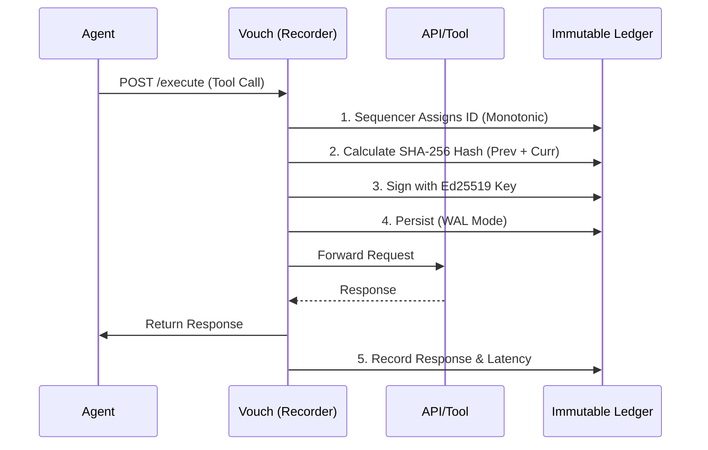

# Vouch: The AI Agent Flight Recorder

> **"If it isn't in the ledger, it didn't happen."**

Vouch is a **forensic-grade flight recorder** for autonomous AI agents. It passively intercepts tool execution, cryptographically signs every action, and persists an immutable, tamper-evident audit trail.

Designed for **Incident Response**, **Legal Defensibility**, and **NASA Power of Ten** safety compliance.

---

[](https://golang.org)
[](LICENSE)
[](https://github.com/slyt3/Vouch/actions)

---

## The Problem: "The Black Box"
When an autonomous agent deletes a production database or executes an unauthorized trade, standard logs are insufficient:
1.  **Mutable**: A compromised agent (or rogue admin) can delete logs to cover their tracks.
2.  **Context-Poor**: Standard logs show *what* happened, but not the *reasoning* or the *raw payload*.
3.  **Legally Weak**: Text files have no chain of custody. They are inadmissible as primary evidence in strict forensic environments.

## The Solution: "The Glass Box"
Vouch acts as a **transparent proxy**. It sits between your agent (Claude, GPT, AutoGPT) and its tools. It does not block; it records.



### Key Features
*   **Immutable Ledger**: Append-only SQLite store with SHA-256 hash chaining (Merkle-like structure).
*   **Cryptographic Identity**: Every event is signed with a high-entropy Ed25519 key unique to the recorder instance.
*   **Passive & Fast**: Zero-blocking logic. < 2ms latency overhead using zero-allocation memory pools.
*   **Legal Admissibility**: Designed to meet [Federal Rules of Evidence 902(13)](https://www.law.cornell.edu/rules/fre/rule_902) standards for self-authenticating records.
*   **Global Anchoring**: Periodically anchors the ledger state to the Bitcoin blockchain (via Blockstream) for external proof of time.

---

## Quick Start

### 1. Installation
```bash
go install github.com/slyt3/Vouch@latest
```

### 2. Start the Recorder
Vouch runs as a sidecar proxy.
```bash
# Start listening on port 9999, forwarding to your tool server on 8080
vouch-proxy --target http://localhost:8080 --port 9999
```

### 3. Connect Your Agent
Point your LLM or Agent framework to the Vouch proxy instead of the direct tool URL.

**Python (LangChain / OpenAI)**
```python
# Route traffic through Vouch
import os
os.environ["OPENAI_BASE_URL"] = "http://localhost:9999/v1"
```

### 4. Forensic Analysis
When an incident occurs, use the CLI to investigate.

**Verify Integrity**
Check if the log file has been tampered with since creation.
```bash
vouch verify
# > ✓ Chain valid. 14,203 events verified.
# > ✓ Signatures valid.
# > ✓ Bitcoin Anchor confirmed (Block #824100).
```

**Trace Agent Reasoning**
Reconstruct the execution tree for a specific task.
```bash
vouch trace <task-id>
```

**Export Evidence**
Create a cryptographically sealed zip file for legal/compliance handover.
```bash
vouch export evidence_bag.zip
```

---

## Architecture

Vouch is built on a **Modular Hexagonal Architecture** to ensure robustness and testability.

*   **`internal/ledger`**: The core cryptographic engine. Handles hashing, signing, and SQLite persistence.
*   **`internal/observer`**: Passive rule engine. Tags events with risk levels (Low, High, Critical) based on `vouch-policy.yaml`.
*   **`internal/interceptor`**: High-performance HTTP proxy logic.
*   **`internal/ring`**: Fixed-size ring buffers for async IO (decoupling recording from forwarding).

See [ARCHITECTURE.md](ARCHITECTURE.md) for detailed system diagrams.

---

## Configuration (`vouch-policy.yaml`)
Vouch is passive, but it *tags* events based on risk. This aids in post-incident filtering.

```yaml
version: "2026.1"
defaults:
  retention_days: 90
  signing_enabled: true

policies:
  - id: "critical-infrastructure"
    match_methods: ["aws:delete_instance", "db:drop_table"]
    risk_level: "critical"
    
  - id: "financial-ops"
    match_methods: ["stripe:refund", "bank:transfer"]
    risk_level: "high"
```

---

## Development Status
Vouch is currently in **v1.0 (Stable)**.
*   [x] Core Ledger & Signing
*   [x] Passive Interception
*   [x] CLI Forensics (Trace, Verify, Export)
*   [ ] Multi-node Consensus
*   [x] HTML Report Generation
*   [ ] PDF Report Generation

## License
Apache 2.0
